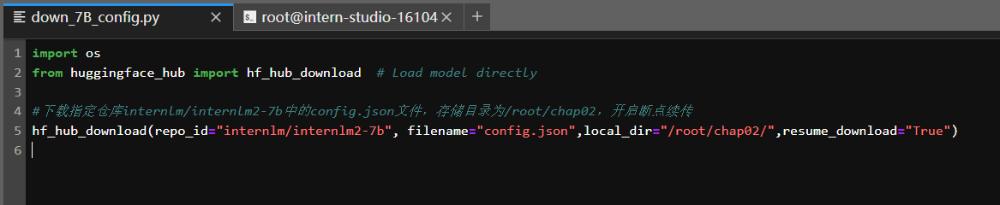

# 02.轻松玩转书生·浦语大模型趣味 Demo

本节课实践 4 个主要内容，分别是：

- **部署 `InternLM2-Chat-1.8B` 模型进行智能对话**
- **部署实战营优秀作品 `八戒-Chat-1.8B` 模型**
- **通过 `InternLM2-Chat-7B` 运行 `Lagent` 智能体 `Demo`**
- **实践部署 `浦语·灵笔2` 模型**

## **Homework**

> **基础作业 (结营必做)**
>
> - 使用 `InternLM2-Chat-1.8B` 模型生成 300 字的小故事（需截图）


### **1. 使用 `InternLM2-Chat-1.8B` 模型生成 300 字的小故事**

step01：下载1.8B模型


step02：执行Demo


> **进阶作业 (优秀学员必做)**
>
> - 熟悉 `huggingface` 下载功能，使用 `huggingface_hub` python 包，下载 `InternLM2-Chat-7B` 的 `config.json` 文件到本地（需截图下载过程）
> - 完成 `浦语·灵笔2` 的 `图文创作` 及 `视觉问答` 部署（需截图）
> - 完成 `Lagent` 工具调用 `数据分析` Demo 部署（需截图）


### **2. 使用 `huggingface_hub` python 包下载 `InternLM2-Chat-7B` 的 `config.json` 文件到本地**

step01：安装依赖

```python
pip install -U huggingface_hub
```

step02：新建chap02文件夹并进入

```
mkdir chap02 && cd chap02
```

step03：新建down_7B_config.py文件并写入代码



step04：运行down_7B_config.py下载`InternLM2-Chat-7B` 的 `config.json` 文件到本地

```
python /root/chap02/down_7B_config.py
```


### 3. 完成 `浦语·灵笔2` 的 `图文创作` 及 `视觉问答` 部署

> `浦语·灵笔2` 是基于 `书生·浦语2` 大语言模型研发的突破性的图文多模态大模型，具有非凡的图文写作和图像理解能力，在多种应用场景表现出色，总结起来其具有：
>
> - 自由指令输入的图文写作能力： `浦语·灵笔2` 可以理解自由形式的图文指令输入，包括大纲、文章细节要求、参考图片等，为用户打造图文并貌的专属文章。生成的文章文采斐然，图文相得益彰，提供沉浸式的阅读体验。
> - 准确的图文问题解答能力：`浦语·灵笔2` 具有海量图文知识，可以准确的回复各种图文问答难题，在识别、感知、细节描述、视觉推理等能力上表现惊人。
> - 杰出的综合能力： `浦语·灵笔2-7B` 基于 `书生·浦语2-7B` 模型，在13项多模态评测中大幅领先同量级多模态模型，在其中6项评测中超过 `GPT-4V` 和 `Gemini Pro`。

step01：安装依赖

```
pip install timm==0.4.12 sentencepiece==0.1.99 markdown2==2.4.10 xlsxwriter==3.1.2 gradio==4.13.0 modelscope==1.9.5
```

step02：下载InternLM-XComposer仓库的代码并对齐版本

```
cd /root/demo
git clone https://gitee.com/internlm/InternLM-XComposer.git
cd /root/demo/InternLM-XComposer
git checkout f31220eddca2cf6246ee2ddf8e375a40457ff626
```

step03：创建internlm-xcomposer2-7b和internlm-xcomposer2-vl-7b软连接

```
ln -s /root/share/new_models/Shanghai_AI_Laboratory/internlm-xcomposer2-7b /root/models/internlm-xcomposer2-7b
ln -s /root/share/new_models/Shanghai_AI_Laboratory/internlm-xcomposer2-vl-7b /root/models/internlm-xcomposer2-vl-7b
```

step04：图文创作及视觉问答部署

#### 1：**图文创作**

​	1.1启动 InternLM-XComposer

```
cd /root/demo/InternLM-XComposer
python /root/demo/InternLM-XComposer/examples/gradio_demo_composition.py  \
--code_path /root/models/internlm-xcomposer2-7b \
--private \
--num_gpus 1 \
--port 6006
```

​	1.2：配置本地PowerShell

```powershell
ssh -CNg -L 6006:127.0.0.1:6006 root@ssh.intern-ai.org.cn -p 40166
```


​	1.3：本地浏览器打开 [http://127.0.0.1:6006](http://127.0.0.1:6006/)


​	1.4：调节相关参数并提交生成


#### 2：**视觉问答**

​	2.1：启动InternLM-XComposer2-vl

```
cd /root/demo/InternLM-XComposer
python /root/demo/InternLM-XComposer/examples/gradio_demo_chat.py  \
--code_path /root/models/internlm-xcomposer2-vl-7b \
--private \
--num_gpus 1 \
--port 6006
```

​	2.2：配置本地PowerShell

```powershell
ssh -CNg -L 6006:127.0.0.1:6006 root@ssh.intern-ai.org.cn -p 40166
```


​	2.3：本地浏览器打开 [http://127.0.0.1:6006](http://127.0.0.1:6006/)


​	2.4：调节相关参数并提交生成


### 4. 完成 `Lagent` 工具调用 `数据分析` Demo 部署

> Lagent 是一个轻量级、开源的基于大语言模型的智能体（agent）框架，支持用户快速地将一个大语言模型转变为多种类型的智能体，并提供了一些典型工具为大语言模型赋能。
>
> Lagent 的特性总结如下：
>
> - 流式输出：提供 stream_chat 接口作流式输出，本地就能演示酷炫的流式 Demo。
> - 接口统一，设计全面升级，提升拓展性，包括：
>   - Model : 不论是 OpenAI API, Transformers 还是推理加速框架 LMDeploy 一网打尽，模型切换可以游刃有余；
>   - Action: 简单的继承和装饰，即可打造自己个人的工具集，不论 InternLM 还是 GPT 均可适配；
>   - Agent：与 Model 的输入接口保持一致，模型到智能体的蜕变只需一步，便捷各种 agent 的探索实现；
> - 文档全面升级，API 文档全覆盖。

step01：下载 Lagent 相关的代码库并对齐版本

```
git clone https://gitee.com/internlm/lagent.git
cd /root/demo/lagent
git checkout 581d9fb8987a5d9b72bb9ebd37a95efd47d479ac
pip install -e . # 源码安装
```

step02：构造internlm2-chat-1.8b软链接快捷访问方式

```
ln -s /root/share/new_models/Shanghai_AI_Laboratory/internlm2-chat-1_8b /root/models/internlm2-chat-1_8b
```

step03：修改/root/demo/lagent/examples/internlm2_agent_web_demo_hf.py文件代码


step04：运行Demo

```
streamlit run /root/demo/lagent/examples/internlm2_agent_web_demo_hf.py --server.address 127.0.0.1 --server.port 6006
```


step05：配置本地PowerShell

```powershell
ssh -CNg -L 6006:127.0.0.1:6006 root@ssh.intern-ai.org.cn -p 40166
```


step06：本地浏览器打开 [http://127.0.0.1:6006](http://127.0.0.1:6006/)


step07：勾选“数据分析”并输入问题


**Done**