# 书生·普语大模型实战营第二期——用茴香豆搭建个人的RAG知识助手

## 一、RAG的基础知识

### 1. 什么是RAG

​	RAG（Retrieval Augmented Generation）技术，通过检索与用户输入相关的信息片段，并结合***外部知识库***来生成更准确、更丰富的回答。解决 LLMs 在处理知识密集型任务时可能遇到的挑战, 如幻觉、知识过时和缺乏透明、可追溯的推理过程等。提供更准确的回答、降低推理成本、实现外部记忆。

**特点**：可以解决大型模型在处理知识密集型任务时面临的各种挑战，如生成幻觉等问题；可以让大型模型具备外部记忆功能，在不需要额外训练的情况下就能获取新知识，降低了整体的成本。

**应用**：问答系统、文本生成系统、信息检索，以及在结合了多模态大模型之后，RAG技术也能够用于图片的描述等。

### 2. RAG的工作原理

- 经典的RNG由三个部分组成：**索引(indexing)、检索(retrieval)、生成(generation)**
- **索引**部分负责处理外部知识，将知识源（如文档、网页）分割成trunk，然后编码成向量，并存储在专用的向量数据库中
- **检索**部分负责接收用户的问题，然后将问题也编码成向量，在向量数据库中找出与问题最相关的内容
- **生成**部分负责将检索到的内容和原始问题一起作为提示，输入到大模型中，生成最终的答案

​	**向量数据库（vector database）**

​	向量数据库是RAG技术当中**专门储存外部数据**的地方，主要是将文本及相关的数据，通过预训练的模型转换为固定长度的向量，这些向量要能够很好地捕捉到我们文本和知识的语义信息及内部联系。

​	向量数据库是**实现快速准确回答的基础**，要能够高效地实现相似性检索，根据用户的查询，快速找出最相关的向量。

​	在面向大规模数据的时候以及需要高速响应的需求的时候，向量数据库是需要进行优化的，很重要的就是对**向量表示**的优化，例如使用更高级的文本编码技术、使用更好的预训练模型等，或去尝试不同的句子嵌入或段落嵌入方法等。

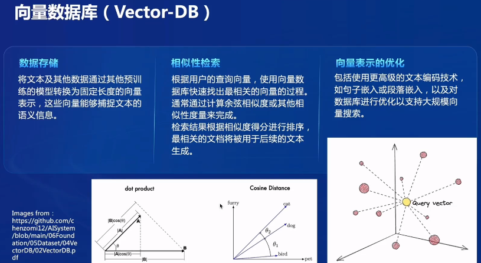

### 3. RAG工作流程

1. 用户输入一个问题或查询。
2. 预处理部分将用户的输入进行筛选和转换，将其转化为合适的问询。
3. 在外部知识库中搜寻相关的内容，并结合大语言模型的能力生成回答。

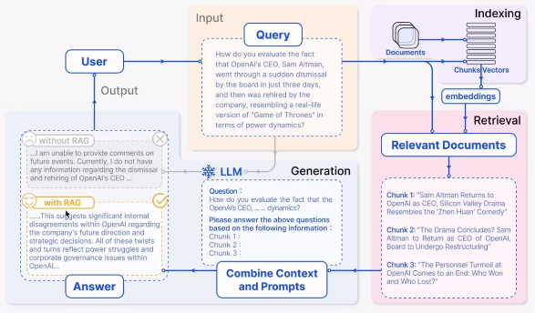

​	针对一些专业性知识或者高时效信息，只需要**不断的更新这个向量数据库**，就可以将大模型的生成能力和我们向量数据库当中的知识内容很好地结合在一起，无需任何训练就能让大模型拥有并处理这些新的知识。

### 4. RAG的发展进程

从提出到现在不到4年的时间已经出现了三种RAG的范式

#### Naive RAG

> 只有索引、检索、生成三个部分构成的最基础的方式

应用：简单的问答系统和信息检索场景

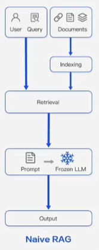

#### Advanced RAG

> 在三个基础部分之外对检索前后都进行了增强,在检索之前对用户的问题进行路由扩展、重写等处理力**（pre-retrieval）**，对于检索到的信息进行重排序、总结融合等处理**（post-retrieval）**，使信息收集和处理效率更高

应用：摘要生成、内容推荐等

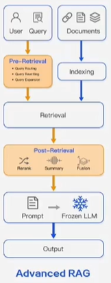

#### Modular RAG

> 将RAG的基础部分和后续各种优化技术和功能**模块化**

应用：可以根据实际业务需求定制完成如多模态任务对话系统等更高级的应用

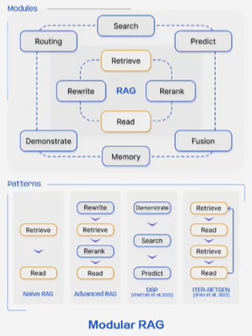

### 5. RAG常见的优化方法

**嵌入式优化**是通过结合稀疏编码器、密集检索器以及多任务的方式来增强嵌入的性能；

**索引优化**是通过增强数据力度、优化索引结构等多种策略来提升索引的质量。

> 嵌入式优化和索引优化是是用来提高向量数据库的质量，从而对RAG的性能进行提升

**查询过程优化**是通过查询扩展和转换等方式使用户的原始问题更适合检索任务；

**上下文管理**是通过重排和上下文选择压缩来减少检索的冗余信息并提高大模型的处理效率。

> 查询过程优化和上下文管理，既Advanced RAG范式中的前检索（pre-retrieval）和后检索（post-retrieval）部分

**迭代检索**是在RAG过程中根据检索结果多次迭代检索知识，为大模型生成提供全面的知识基础；

**递归检索**是通过迭代细化查询，来改进搜索结果的*深度和相关性*，使用了链式推理来指导检索过程，并根据检索结果细化推理过程；

**自适应检索**是用Flare、Self-RAG等，让大模型能够自主的决定他所要检索的内容、最佳时机等因素。

> 迭代检索、递归检索、自适应检索是RAG的检索部分（retrieval）优化的三种常见方式

**LLM微调**可以根据场景和数据特征对大模型进行定向微调，也可以根据大模型对于检索或生成的参与进行有针对性的微调。

### 6. RAG vs. Fine-tuning

|             | 场景                               | 优势                           | 局限                                               |
| ----------- | ---------------------------------- | ------------------------------ | -------------------------------------------------- |
| RAG         | 需要结合最新信息和实时数据的任务   | 动态知识更新，处理长尾知识问题 | 依赖于外部知识库的质量和覆盖范围。依赖大模型的能力 |
| Fine-tuning | 数据可用且需要模型高度专业化的任务 | 模型能针对特定任务优化         | 需要大量的标注数据，且对新任务的适应性较差         |

> 虽然微调可以在一定程度上改善模型的表现，但其也需要面临诸多挑战和限制。例如需要大量的标注数据才能有效实施微调；可能导致过度拟合等问题影响泛化能力；并且每次信息更新都可能需要再次进行

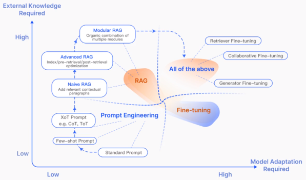

### 7. 如何评价一个RAG技术

> 通常将RAG技术当中的检索阶段和生成阶段进行单独的分别评价

- 传统NLP领域的经典评估指标可以用于RAG的检索过程和生成过程的评价；

- 专门的RAG评测框架

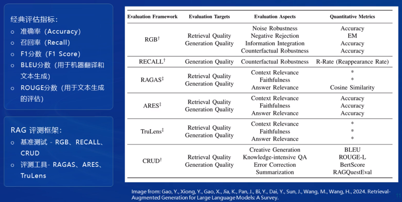

### 8. 总结

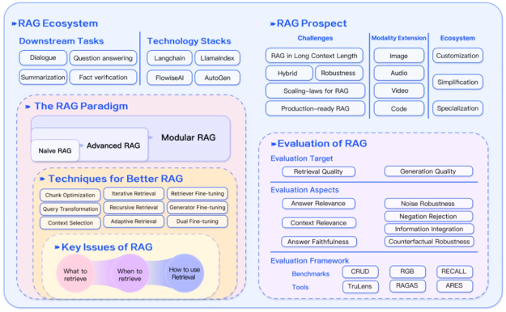

------

## 二、茴香豆

​	茴香豆（豆哥）是一款基于Retrieval Augmented Generation（RAG）技术的知识助手应用。RAG技术通过检索与用户输入相关的信息片段，并结合外部知识库来生成更准确、更丰富的回答，它能够帮助用户快速获取知识，且无需训练就可以掌握新领域的知识，从而解决大型语言模型在处理知识密集型任务时可能遇到的挑战。

### 1. **应用特点**

​	茴香豆应用能够通过RAG技术，让基础模型实现非参数知识更新，无需训练就可以掌握新领域的知识。此外，茴香豆还支持从本地向量数据库中检索内容进行回答，也可以加入网络的搜索结果，生成回答。

### 2. **应用场景**

​	茴香豆可以应用于各种需要知识问答的场景，如客服机器人、智能家居等。通过茴香豆，用户可以快速、高效地获取到他们所需要的知识。

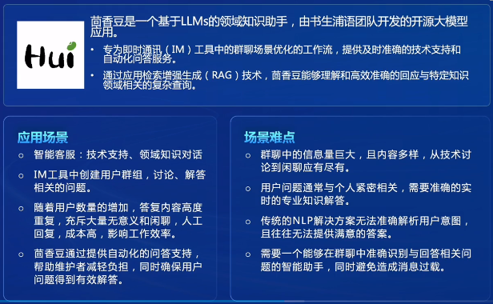

> 它具有开放源代码、可免费商业使用的优点

> 具备良好的安全性及扩展性，它可以被应用于各类即时通信软件或交流社区中，也能与其他大型模型及其云接口相结合，提供了非常灵活的选择空间

### 3. 构成及工作流

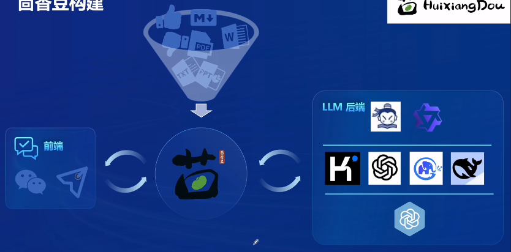

- **知识库**：通常为企业内部或个人所在领域的专业技术文档。支持markdown、Pdf、Word、txt等常用文件格式。

- **前端**：问答助手用于读取和回答用户提问的平台。如微信、飞书等。

- **大模型**：支持本地调用大模型，如书生浦语和通义千问的模型格式，以及远端大模型的API及API集成工具，如kimi、chat gtp、deepsick、chatglm等。

- **工作流**：通过设置问题相关性阈值，对用户问题进行判断，决定是否需要进行回答。

  ​	**预处理**(preprocess)：将用户的输入筛选，然后转换为合适的问询

  ​	**拒答**(rejection pipeline)：通过对该问询本身的分析，以及该问询与数据库当中示例问题的比较来给出问题相关性的得分，根据得分来判断该问题是否要进入回答环节

  ​	**应答**(response pipeline)：大模型根据问询和检索到的知识内容进行答案的生成并返回给用户

  ​	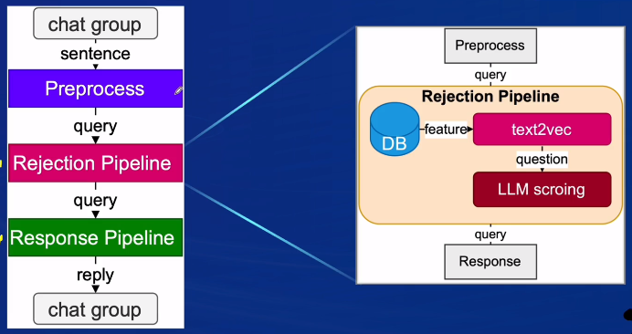

- **应答模块**：采用多来源检索、混合模型及安全评估等方式，保证回答内容的准确性。在生成部分，既可以使用本地模型，也可以使用远端模型，使用混合的模式来共同处理生成任务。

- **安全检测模块**：在直接输出给最终用户前，会对回答内容进行安全检测，确保符合要求。

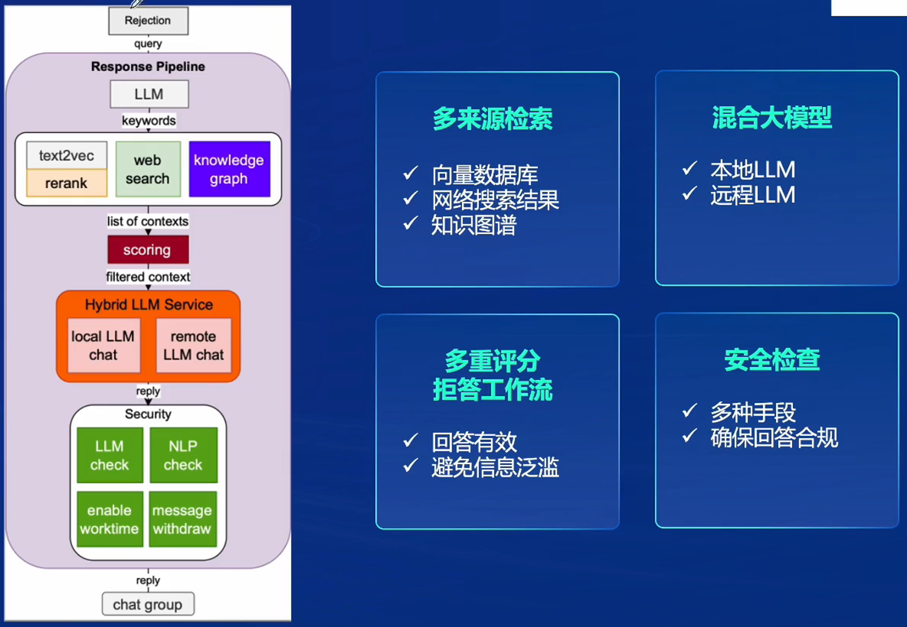

------

## 三、实践

### 一、茴香豆web版

#### 1. 登录茴香豆web版页面

https://openxlab.org.cn/apps/detail/tpoisonooo/huixiangdou-web

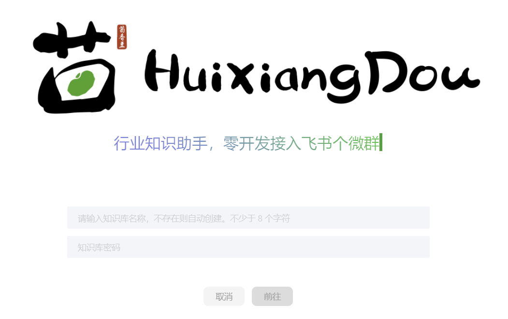

#### 2. 创建（进入）自己的知识库

> 知识库的名称要大于8个字符

#### 3. 上传自己领域的知识文档到服务器上

> web版目前支持的文档格式很丰富

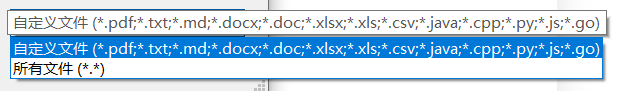

打开上传窗口

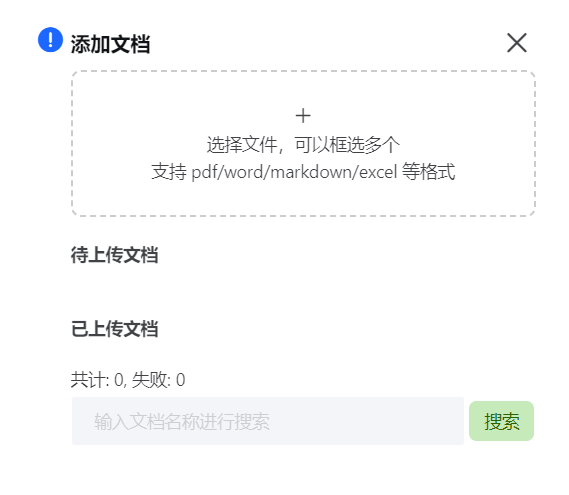

选择需要的文件进行上传

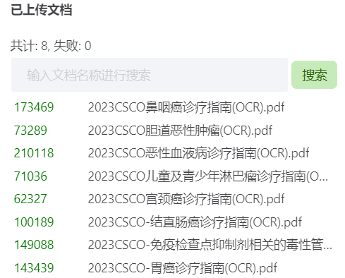

#### 4. 设置正反例

#### 5. 在线知识助手对话

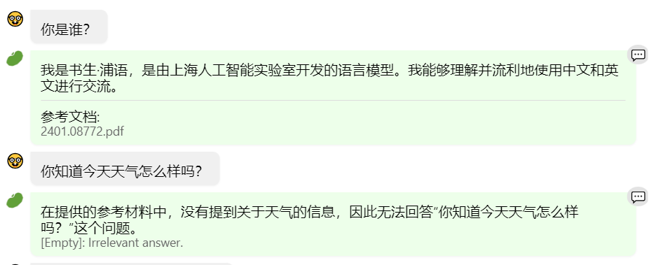

> 可以提示回答所参考的文档
>
> 也出现过一个问题👇

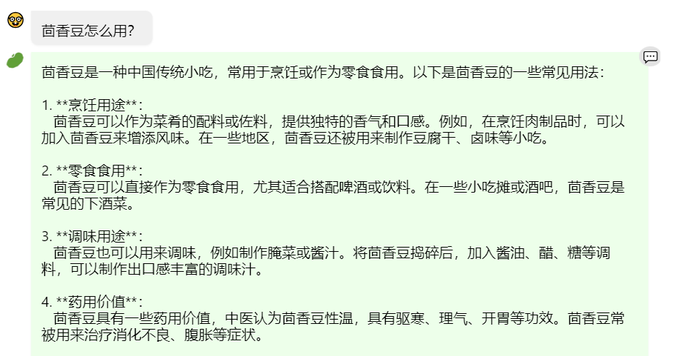

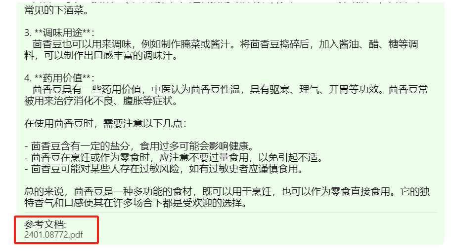

> 分析应该是提问的方法不对，本身“茴香豆”在日常生活总就是一个食品，在我们这里是一个应用，我用了“怎么用”来进行提问，这个确实感觉有歧义。
>
> 更换了问法，回答就没问题了👇

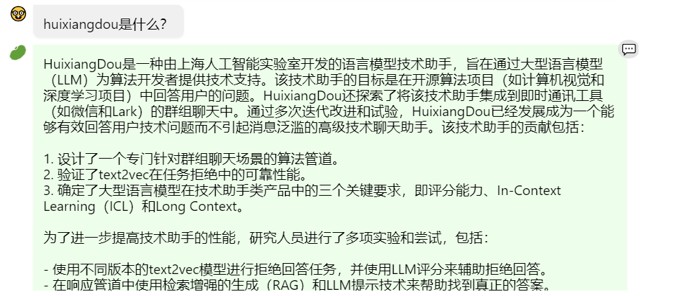

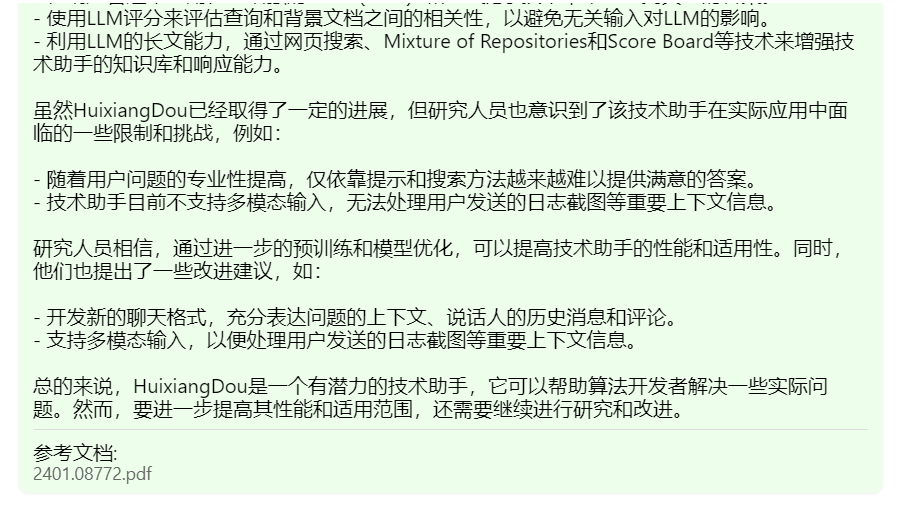

> 所以，“提问的智慧”不光是在与人交流中，与大模型交流也一样需要。

#### 6. 调用端口部署到自己的飞书群