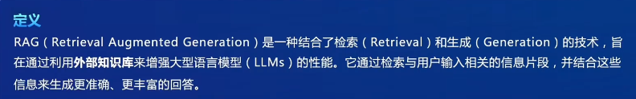
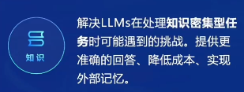
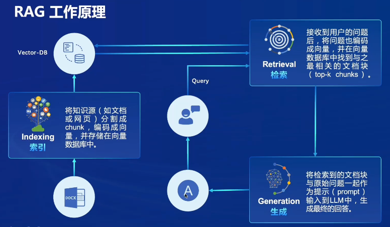

# 书生·普语大模型实战营第二期——用茴香豆搭建个人的RAG知识助手

## 一、RAG的基础知识

### 1. 什么是RAG

​	RAG（Retrieval Augmented Generation）技术，通过检索与用户输入相关的信息片段，并结合***外部知识库***来生成更准确、更丰富的回答。解决 LLMs 在处理知识密集型任务时可能遇到的挑战, 如幻觉、知识过时和缺乏透明、可追溯的推理过程等。提供更准确的回答、降低推理成本、实现外部记忆。

**特点**：可以解决大型模型在处理知识密集型任务时面临的各种挑战，如生成幻觉等问题；可以让大型模型具备外部记忆功能，在不需要额外训练的情况下就能获取新知识，降低了整体的成本。

**应用**：问答系统、文本生成系统、信息检索，以及在结合了多模态大模型之后，RAG技术也能够用于图片的描述等。

### 2. RAG的工作原理

- 经典的RNG由三个部分组成：**索引(indexing)、检索(retrieval)、生成(generation)**
- **索引**部分负责处理外部知识，将知识源（如文档、网页）分割成trunk，然后编码成向量，并存储在专用的向量数据库中
- **检索**部分负责接收用户的问题，然后将问题也编码成向量，在向量数据库中找出与问题最相关的内容
- **生成**部分负责将检索到的内容和原始问题一起作为提示，输入到大模型中，生成最终的答案

## 二、茴香豆

## 三、实践