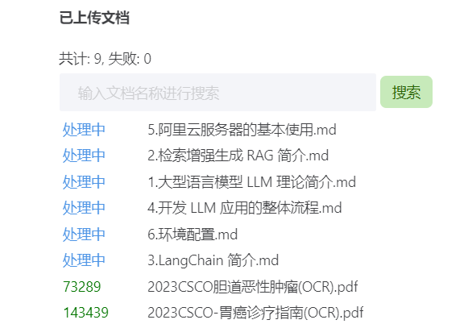

# 第三课作业

## 基础作业

### 1. 在[茴香豆 Web 版](https://openxlab.org.cn/apps/detail/tpoisonooo/huixiangdou-web)中创建自己领域的知识问答助手

> - 参考视频[零编程玩转大模型，学习茴香豆部署群聊助手](https://www.bilibili.com/video/BV1S2421N7mn)
> - 完成不少于 400 字的笔记 + 线上茴香豆助手对话截图(不少于5轮)
> - （可选）参考 [代码](https://github.com/InternLM/HuixiangDou/tree/main/web) 在自己的服务器部署茴香豆 Web 版

Done.

### 2. 在 `InternLM Studio` 上部署茴香豆技术助手

> - 根据教程文档搭建 `茴香豆技术助手`，针对问题"茴香豆怎么部署到微信群？"进行提问
> - 完成不少于 400 字的笔记 + 截图

Done.

## 进阶作业

### A.【应用方向】 结合自己擅长的领域知识（游戏、法律、电子等）、专业背景，搭建个人工作助手或者垂直领域问答助手，参考茴香豆官方文档，部署到下列任一平台。

> - 飞书、微信
> - 可以使用 茴香豆 Web 版 或 InternLM Studio 云端服务器部署
> - 涵盖部署全过程的作业报告和个人助手问答截图

#### 1. 使用茴香豆 Web 版新建知识库

#### 2. 上传相关知识库文档

#### 3. 验证知识库内容

#### 4. 飞书bot与茴香豆web版对接

将加密策略填入bot对应配置

参考配置教程：https://aicarrier.feishu.cn/docx/H1AddcFCioR1DaxJklWcLxTDnEc

将bot相关参数填入茴香豆web版配置处

#### 5. 发布bot并添加进对应群聊

#### 6. 为群聊名称添加对应后缀

#### 7. 在群聊中提出问题，bot自动回答

Done.